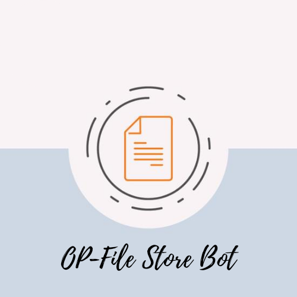

<p align="center">
  
</p>
<h1 align="center">
  <b>𝙾𝙿-𝙵𝙸𝙻𝙴 𝚂𝚃𝙾𝚁𝙴 𝙱𝙾𝚃</b>
</h1>
<div align="center">


<a href=https://youtu.be/kB9TkCs8cX0></a>
<a href=https://www.instagram.com/_aadil_m__></a>
<p align="center">


<a href="https://t.me/Aadhi011"></a>
</p>
</div>
Telegram Bot to store Posts and Documents and it can Access by Special Links.
I Guess This Will Be Usefull For Many People.....😇. 


### Features
- Fully customisable.
- Customisable welcome & Forcesub messages.
- More than one Posts in One Link.
- Can be deployed on heroku directly.

### Setup

- Add the bot to Database Channel with all permission
- Add bot to ForceSub channel as Admin with Invite Users via Link Permission if you enabled ForceSub 

##
### Installation
#### Deploy on Heroku
[](https://heroku.com/deploy?template=https://github.com/Aadhi000/OP-Files-Store-Botttt)</br>
<a href="https://youtube.com/channel/UCf_dVNrilcT0V2R--HbYpMA">
  
</a><br>
**Check This Tutorial Video on YouTube for any Help**<br>

#### Deploy in your VPS
````bash
git clone https://github.com/Aadhi000/OP-Files-Store-Bot
cd File-Sharing-Bot
pip3 install -r requirements.txt
# <Create config.py appropriately>
python3 main.py
````

### Admin Commands

```
/start - start the bot or get posts

/batch - create link for more than one posts

/genlink - create link for one post

/users - view bot statistics

/broadcast - broadcast any messages to bot users
```

### Variables

* `API_HASH` Your API Hash from my.telegram.org
* `API_ID` Your API ID from my.telegram.org
* `TG_BOT_TOKEN` Your bot token from @BotFather
* `OWNER_ID` Must enter Your Telegram Id
* `CHANNEL_ID` Your Channel ID eg:- -100xxxxxxxx
* `ADMINS` Optional: A space separated list of user_ids of Admins, they can only create links
* `START_MESSAGE` Optional: start message of bot, use HTML 
* `FORCE_SUB_MESSAGE`Optional:Force sub message of bot, use HTML and Fillings
* `FORCE_SUB_CHANNEL` Optional: ForceSub Channel ID, leave 0 if you want disable force sub

### Extra Variables

* `CUSTOM_CAPTION` put your Custom caption text if you want Setup Custom Caption, you can use HTML
* `DISABLE_CHANNEL_BUTTON` Put True to Disable Channel Share Button, Default if False

### Fillings
#### START_MESSAGE | FORCE_SUB_MESSAGE

* `{first}` - User first name
* `{last}` - User last name
* `{id}` - User ID
* `{mention}` - Mention the user
* `{username}` - Username

#### CUSTOM_CAPTION

* `{filename}` - file name of the Document
* `{previouscaption}` - Original Caption


## Support   
Join Our [Telegram Group](https://www.telegram.dog/OpusTechz) For Support/Assistance And Our [Channel](https://www.telegram.dog/OpusTechz) For Updates.   
   
